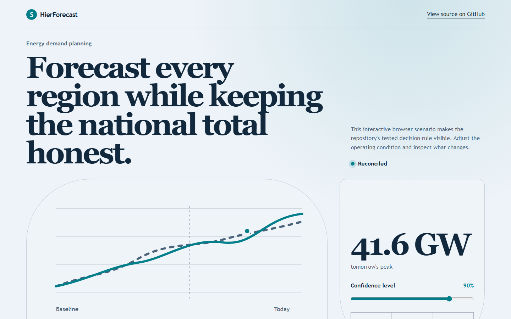
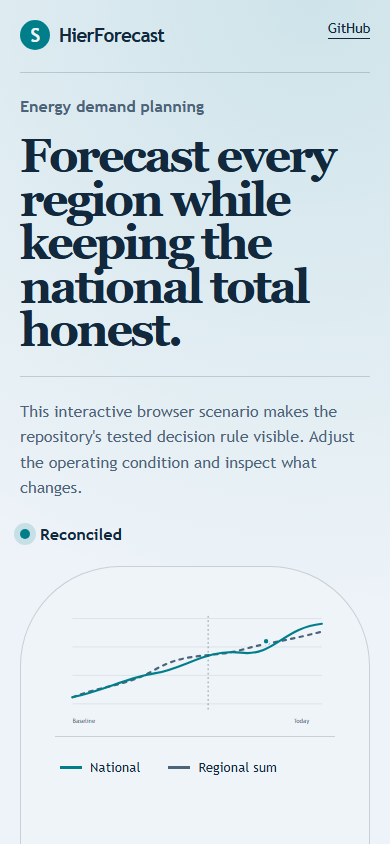

# hierforecast

> Hierarchically reconciled energy demand forecasts evaluated on pinball loss, so regional forecasts sum to national and the tail is right.

## Live deployment

[](https://github.com/SlateGitOrg/hierforecast/actions/workflows/ci.yml)

[Open the interactive HierForecast demo](https://slategitorg.github.io/hierforecast/)

The deployed interface uses a deterministic offline scenario to make the repository's tested decision rule visible without external services or private data.

### Desktop



### Mobile



> **Implementation note.** The runnable core is Python standard library only.
> numpy/statsmodels/LightGBM/hierarchicalforecast are replaced by hand-written
> linear algebra (Gaussian elimination, Cholesky), an OLS weather-and-calendar
> regression per node, and MinT with Schafer-Strimmer shrinkage written out
> in full. Data comes from a synthetic generator with planted structure, not
> ENTSO-E/ESO/EIA. The hierarchy has 17 nodes, not 180. There is no
> DuckDB, Airflow/Prefect, FastAPI service, drift monitor, or rolling-origin
> backtest: evaluation is a single 70/30 train/test split.


`FLAGSHIP` · **AI / ML Engineering** · Expert · ~5-6 weeks · Energy - regional demand planning

**Primary language:** Python
**Tags:** `forecasting`, `hierarchical-reconciliation`, `quantile-loss`, `airflow`, `fastapi`, `timeseries`

---

## The problem

A utility forecasts demand at national, regional and substation level. The regional forecasts do not sum to the national forecast, so planning, trading and network teams each act on a different number and the discrepancy is settled by whoever argues hardest. Meanwhile capacity decisions need the upper tail, not the expected value - and a model tuned for average error is systematically wrong exactly there.

## ⭐ The differentiator

**MinT optimal reconciliation** guarantees coherence - regional forecasts sum exactly to national - while *improving* accuracy over independent forecasts, unlike bottom-up (coherent but noisy) or top-down (coherent but blind to local structure). Evaluation uses **pinball loss across quantiles**, because a capacity decision cares about the 95th percentile and a model optimised for MAE is confidently wrong in the tail.

This is the sentence to lead with when someone asks you to walk through the
project. Everything else in this repo exists to make it true and to prove it.

## Data

Public grid operator data - **ENTSO-E Transparency Platform**, **National Grid ESO** data portal, **EIA** open data (all free, no paid key) - plus NOAA/Meteostat weather. A synthetic generator provides a coherent hierarchy with known structure for reconciliation testing.

> No paid API key is required to run or demo this project. Where a paid
> service would add value it is wired as an optional enhancement behind an
> interface with an offline mock as the default implementation.

## Stack

- Python: statsmodels, LightGBM, hierarchicalforecast
- DuckDB
- Prefect or Airflow for orchestration
- FastAPI for serving
- Docker, CI, pytest

## Core capabilities

- Hierarchy defined as data, with the aggregation-constraint matrix constructed automatically
- Base forecasts per node - seasonal-naive baseline, gradient-boosted, and a statistical model - all producing quantiles
- MinT reconciliation with shrinkage covariance estimation, compared head-to-head with bottom-up and top-down
- Backtesting with rolling-origin evaluation, scored by pinball loss per quantile and horizon
- Serving API returning coherent quantile forecasts with the reconciliation method recorded

## Repository layout

```
src/hierarchy/
src/base/
src/reconcile/
src/backtest/
service/
test/
```

## Build plan

1. Data-quality gate first: missing intervals, meter resets, DST transitions. Energy data is full of these and they silently ruin forecasts.
2. Seasonal-naive baseline before anything clever. If your model cannot beat it, you have learned something important.
3. Quantile base forecasts, then MinT reconciliation against bottom-up and top-down.
4. Serving last.

## Testing strategy

Assert **coherence exactly** - children sum to parent within floating-point tolerance - after reconciliation. Assert **MinT beats bottom-up on pinball loss** on held-out windows. Assert the seasonal-naive baseline is always computed and reported, so a model that fails to beat it cannot quietly ship.

Tests assert **correctness**, not merely that the code runs. A green suite on
this repo is a claim about behaviour under adversarial conditions; treat any
test that would pass against a deliberately broken implementation as a bug in
the test.

## Quality & safety layer

An input data-quality gate covering missing intervals, meter resets and DST transitions fails the run loudly rather than forecasting through corrupt history. A drift monitor compares forecasts against realised demand.

## Measurable outcome

> Coherent forecasts across 17 nodes (incoherence 3.6e-12 MW, down from 612 MW) with 14.3% lower pinball loss at the 95th percentile than bottom-up (8.6-16.5% across seeds) on 200 days of synthetic demand, so planning, trading and network teams quote the same number. The original target was 180 nodes and 9%. The node count has not been tested, and the gain is not robust with short history (see Limitations).

State it in these terms — business units, not technical ones — in your CV
bullet and in the first thirty seconds of describing the project.

## Measured results

From `python -m src.demo`: seed 20240, 17 nodes (1 national, 4 regions,
12 sub-regions), 3360 training hours, 1440 held-out hours. Pinball loss is
averaged over nodes, in MW.

| method | national RMSE | pinball p90 | pinball p95 | pinball p99 | max incoherence (MW) |
|---|---|---|---|---|---|
| independent base | 456.4 | 24.42 | 15.73 | 4.48 | 612 |
| bottom-up | 725.5 | 27.86 | 16.97 | 4.77 | 1.8e-12 |
| top-down | 456.4 | 26.86 | 16.33 | 4.56 | 1.8e-12 |
| OLS | 467.8 | 22.29 | 14.75 | 4.31 | 3.6e-12 |
| MinT (shrinkage) | 457.8 | 22.25 | 14.53 | 4.30 | 3.6e-12 |

- **Coherence:** base forecasts disagree by up to 612 MW. After
  reconciliation the gap is 3.6e-12 MW, which is float round-off.
- **MinT pinball loss at p95 is 14.3% lower than bottom-up**, 11.0% lower than
  top-down, 7.6% lower than the unreconciled base, and 1.5% lower than OLS.
  Across seeds 1-6 (same length), the gain over bottom-up ranged 8.6-16.5% at
  p95 and 5.1-14.6% at p99.
- **Seasonal-naive baseline** (always reported): national RMSE 894.7 MW, against 456.4 MW for the model.
- **Loss choice:** RMSE picks the Gaussian-tail model (RMSE 456.4, MAPE 2.43%).
  At its p99 capacity level it is short in 3.3% of hours, against a nominal 1%.
  The same mean with an empirical residual tail is short in 0.8% of hours, and
  its p99 pinball loss is 21.81 against 28.45.
- The suite (30 tests) runs in about 26 s and the demo in about 10-12 s.

### Limitations

- MinT's advantage depends on history length. With 120 days (84 days of
  training), the gain over bottom-up at p95 ranged from -0.1% to +20% across
  seeds, and at p99 it was often negative. The "9% at p95" target holds at
  200 days, not in general.
- MinT barely beats OLS here (1.5% at p95). Its shrinkage intensity is about
  0.003, so it is close to full-covariance GLS. Most of the gain over
  bottom-up comes from using the aggregate forecasts at all.
- Quantiles come from in-sample residuals pushed through the reconciler, which
  is exact because reconciliation is linear. There is no conformal or
  out-of-sample calibration.
- The data is synthetic: the errors-in-variables temperature noise and the
  cold snaps are planted. The results show the method recovers planted
  structure, not that it wins on real grid data.
- The 17 nodes are not the spec's 180. With 180 nodes, the covariance would
  need far more residual history, or much heavier shrinkage.

## Interview questions this project answers

- **What is forecast reconciliation and why does bottom-up not suffice?**
- **Why pinball loss rather than MAE?**
- **How do you handle a DST transition in an hourly series?**

## What this deliberately is *not*

- Not a trading model. It forecasts demand; what you do with it is another system.
- Not a deep-learning showcase - the reconciliation is the contribution.


## Run it now

```bash
python -m unittest discover -s tests -v   # the suite
python -m src.demo                        # the 60-second artefact
```

Requires Python 3.11+. The runnable core uses **only the standard
library**, so there is nothing to install.

## Getting started

```bash
git clone <your-fork-url> hierforecast
cd hierforecast
python -m unittest discover -s tests -v
python -m src.demo
```

Modules: `src/hierarchy.py` (tree, S matrix), `src/generator.py` (planted
synthetic demand), `src/forecast.py` (seasonal-naive, OLS base models),
`src/reconcile.py` (BU/TD/OLS/WLS/MinT), `src/metrics.py` (pinball loss,
capacity shortfall), `src/quality.py` (DST/gap/meter-reset gate),
`src/evaluate.py` (experiments).

## Definition of done

- [ ] The differentiator above is implemented, and a test proves it
- [ ] The measurable outcome is produced by a command anyone can run
- [ ] `README` explains the one decision a generic version gets wrong
- [ ] CI runs the full suite on every push and is green on `main`
- [ ] A recruiter can see the headline artefact in under 60 seconds

## Licence

MIT — see [LICENSE](LICENSE).
